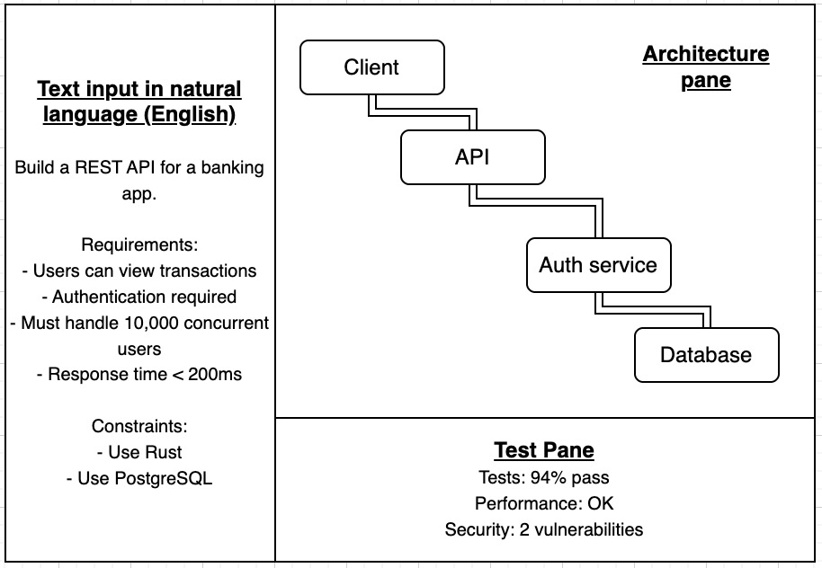

## Introduction

Currently, software engineering is a highly manual process, involving the writing of explicit instructions in programming languages. However, with the advance of artificial intelligence, the industry looks poised for a significant transformation and the introduction of a new programming paradigm. This essay explores the future of software engineering in the context of AI, examining how it may evolve and the implications for the role of software engineers, and the industry as a whole. 

## Software Engineering 3.0

Andrej Karpathy, a prominent figure in the AI community with previous rokes at openAI and Tesla, has proposed the concept of "Software Engineering 3.0" to describe the future of software development in an AI enabled world. The concept (and those before it are explained below):

- **Software Engineering 1.0**: The era of manual programming, where developers write explicit code in programming languages to create software applications. This is the current state of software engineering.
- **Software Engineering 2.0**: Enter neural networks, now developers curate data and choose model architectures rather than writing explicit rules. The software is then "written" by training neural networks on large datasets to learn rules, with network weights serving as the executable code.
- **Software Engineering 3.0**: The future era where developers will use natural language to specify the behavior of software systems. AI models will then generate the underlying code and architecture based on these specifications, *theoretically* allowing for more intuitive and efficient software development.

This last shift has been enabled by large language models (LLMs), which are neural networks trained on vast amounts of data (containing natural language and source code) to learn patterns and relaitonships. As a results they are now capable of producing syntactically correct and often functional code based on natural language prompts - a significant step onwards from just writing, now to full code generation. However, Whilst moddels may become more proficient at generating code than humans, I can't see humans being removed from the process entirely, though their function will obviously change. In terms of what the code generation process might look like, my opinion is in the next section.

## Natural Language as a programming interface

> "The hottest new programming language is English." — Andrej Karpathy

Should interaction through LLMs become the norm for code generation, it's hard for me to imagine a world where code commonly is written by humans, hence you can see why the quote above and wider vision of SWE 3.0 is so compelling as programming though formal syntax would be rendered obsolete in this case. If LLM generated code does become standard, then the programming process and IDE, to me, might look something like this: 

{ width=85% column-span=all fig-align="center" }

An NLP interface would liekely be structured around some kind of component where developers define system bahaviour, requirements and restraints for the AI agent to generate the raw code from. The difference from now will come from the assumption that AI would become superior at generating but more importantly reviewing and debugging the code, hence reduce any need for a human to see the code itself. The assumption is heavily limited, but I'll explore that later. This way, the human would interact at a higher level of abstraction - defining requirements then reviewing the output until a solution ready for depolyment is reached. Architecturally, I can see a diagram based system being used where the LLM generates a visual structure of the system to convey its understanding of the task, which the developer can interact with to make adjustments and ensure the LLM has sufficiently understood the initial prompt. This kind of system would obviously be a huge shift and would require a substantial amount of trust to be placed in AI, based on the fact that the human would be entirely reliant on the LLM to both generate and maintain the code. As the industry becomes more comfortable with this, I can see it becoming a reality for smaller scale projects like startups, whilst larger enterprises like banks would likely not adopt this approach for a long time, if at all, due to the risk involved.

## The changing role of the software engineer

If the above is true, then the role of the software engineer will shift away from writing code to defining requirements, designing system architecture and overseeing the development process. Important skills in this future for software engineers would include clear thinking and the ability to unambiguously convey the constraints and requirements of the system to the LLM. The role would likely become more focused on high level design and problem solving, rather than pure coding. In my opinion, currently, AI is poor at understanding entire systems due to operating on a limited context window (and lacking deep awareness) - therefore successful engineers will have precise problem definition, strong judgement when designing architecture and the ability to review AI output and ensure it satisfies requirements and is secure. Another interesting aspect of this is ownership - should the system fail, who is responsible if all of the code was generated by an LLM? Surely then the engineer overseeing the project would be liable, so the job must be done by someone who can manage risk and assess tradeoffs effectively.

## The future: tools and languages

Software now underpins literally anything from finance to healthcare, meaning safer, correctness focused languages will become popular. Languages like Rust, which focus on memoryy safety and compile time guarantees, will see increased adoption to reflect larger scale and system risk. One key language I can see growing in the future is Mojo. This aims to replace Python as the standard for data science and machine learning, offering significant performance improvements and better safety features (like ownership and memory control like Rust). Mojo is designed specifically for GPU programming, crucial for ML workloads. Another cool thing I've seen is AI native diagram generation, where AI can read the codebase/repo and generate visual system diagrams to understand dependencies, data flows, API relationships etc. without the manual documentation work. A future workflow that seems interesting to me is a 2 way system where the developer can modify the diagram to make architectural changes, and the AI can update the code accordingly - removing the bottleneck between poor prompts and the consequentially poor understanding of the system by the AI.

## Economic and industry implications

The enablement of AI generated code makes it easy to imagine a future without software engineers, but I don't think this is likely. In economics, Jevons paradox describes the phenomenon where the introduction of efficient technology causes the cost of a resource to decrease, where the demand then increases (assuming the resource is elastic). The classic example is the steam engine, which made coal more efficient to use, catually causing an increase in coal demand. Similarly, if applied here, the introduction of AI generated code would make software development more efficient and cheaper, which would likely lead to an increase in demand for software applications. This would then create more jobs for software engineers to oversee the development process, design system architecture and ensure the quality of the output. Additionally, as AI becomes more prevalent in software engineering, there will likely be a growing need for professionals who can manage and maintain these AI systems, creating new job opportunities in the field. The concept of creative destruction also appies here, where implementation heavy or routine programming roles may be destroyed, but new roles focused on higher level design, management of AI systems and auditing of AI generated code or output may be created. Overall, while the nature of software engineering jobs may change, I believe the demand for skilled professionals in the field will increase hugely. Labour economics also suggests that tehcnological change disproportionatley affects different skill levels, with unproductive engineers easily being replaced whilst highly skilled engineers who can effectively leverage AI will be in high demand, creating a greater divide between the two groups.

## Limitations and counterarguments

Much of the vision of software engineering 3.0 rests on a set of very shaky assumptions about the abilities of AI both now and in the future:

- **Diminishing Productivity Gains**: This is the assumption that the productivity gains from AI development will continue to increase at the same rate. In reality, training data is finite in quantity, the costs of training are increasing exponentially (without much realised profit) and performance gains per unit of compute are diminishing. If AI training becomes economically unviable, then progress may slow significantly.
- **Lack of True Reasoning Ability**: Current models predict tokens based on patterns; researchers argue that LLMs lack the ability to reproduce human level reasoning. This renders them incapable of long term system level planning or architecture design, which is crucial for software engineering. If this is the case, then the vision of SWE 3.0 may never be realised.
- **Verification/Error Diagnosis**: LLMs are known to hallucinate and produce incorrect but plausible outputs like calling libraries or APIs that simply don't exist. The fact that errors are not immediately obvious means the review process of AI generated code is difficult.
- **Risk and Liability**:

  > "A computer can never be held accountable. Therefore a computer must never make a management decision." — IBM Training Manual, 1979

  This quote raises an important point around where the responsibility lies when AI generated code fails. If the human overseeing the project is liable, then they must have the skills to manage risk and assess tradeoffs effectively, which may not always be the case. For core systems like finance or healthcare, the risk may simply be too high to adopt AI generated code beyondt the current level of using it.

## Conclusion

I think the future of software engineering will heavily depend on the trajectory of AI development; if this continues at the current pace I can see the vision of SWE 3.0 becoming realised. In particular, a system where developers interact with LLMs via natural language and diagrams to generate code based on a shared idea of what the system architecture might look like. Overall, AI is sure to increase productivity and change the nature of software jobs, but I don't believe in a future without software engineers as the demand for software applications will grow so much. The only uncertainty for me is whether or not AI progress will continue or plateau.
